# Deep-Learning-Charity-Funding-Predictor:

For a non-profit foundation Alphabet Soup business team, we have created an an algorithm to predict whether or not applicants will be successful for funding.
Following are the steps performed during this process.

## Step 1: Exploratory Data Analysis (EDA):

- Dependecies are imported and dataset is loaded from the resources folder.

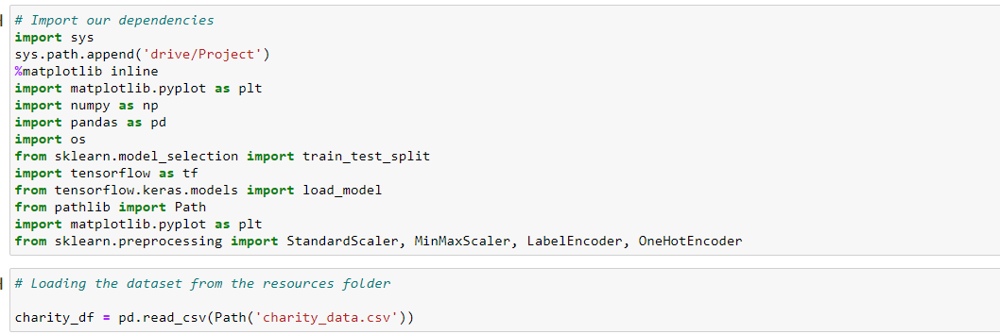

- Drop the unnamed column as it does not contribute to clustering or add value to input data.

- List the DataFrame's data types to ensure they're aligned to the type of data stored on each column.

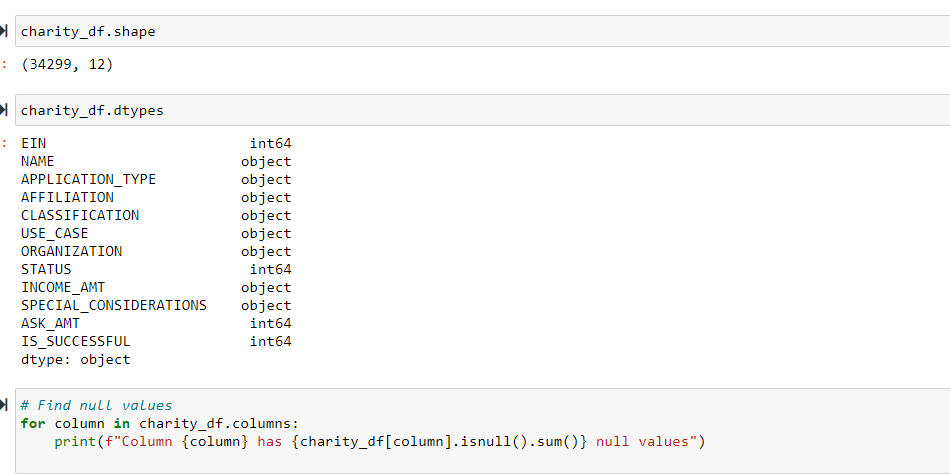

- Columns whose data type need to be changed are inspected and corresponding adjustments are made.

- Unnecessary column are checked that need to be dropped from the dataset.

- Duplicates are detected .

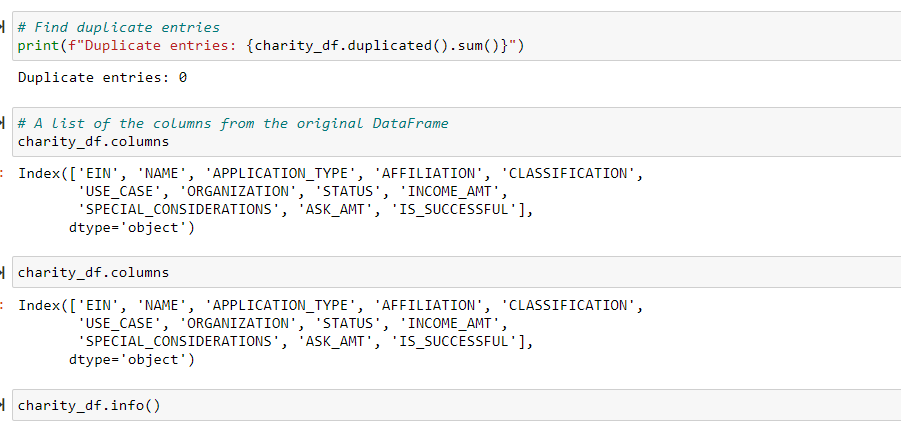

- Code for finding the missing values  is processed.

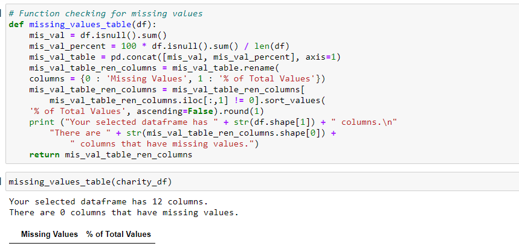

## Step 2: Data Preprocessing:

- Drop 'EIN', 'NAME' columns from the dataframe

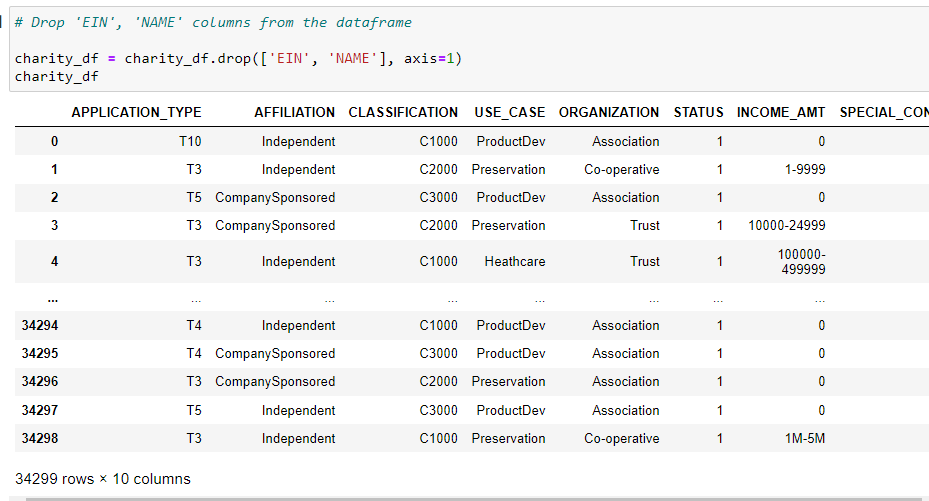

- 'INCOME_AMT' column is splitted into lower and upper income columns.

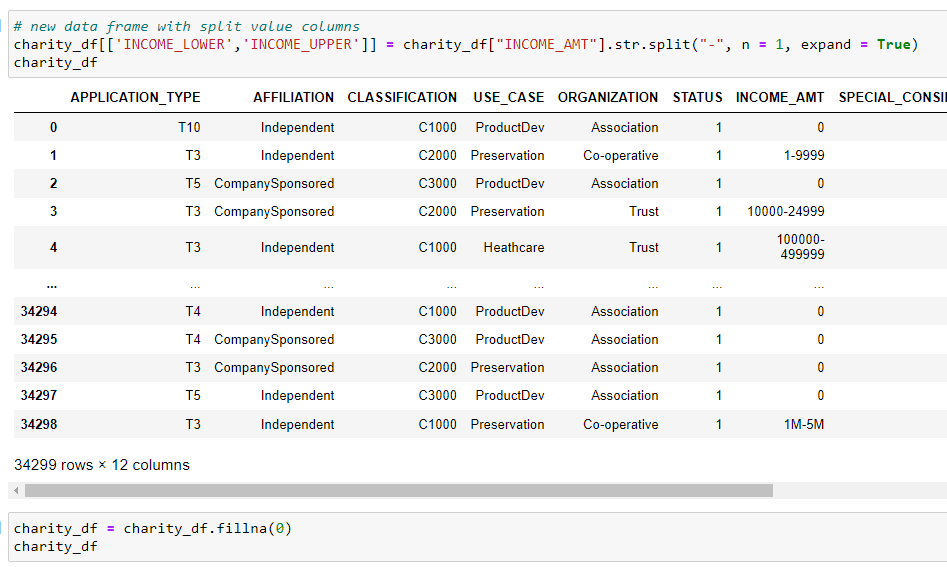

- Special characters are removed from the column values.

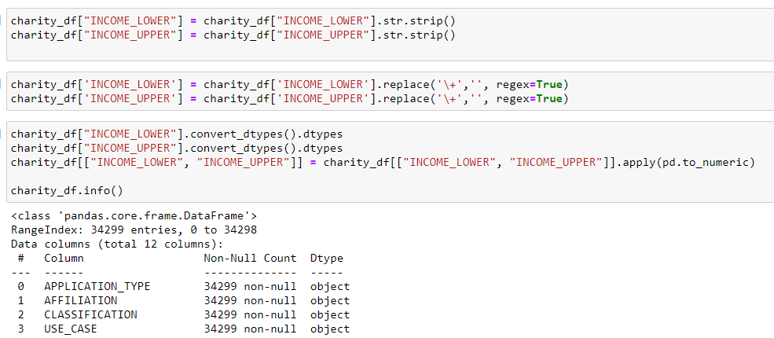

- Object datatypes are converted into numeric data types.

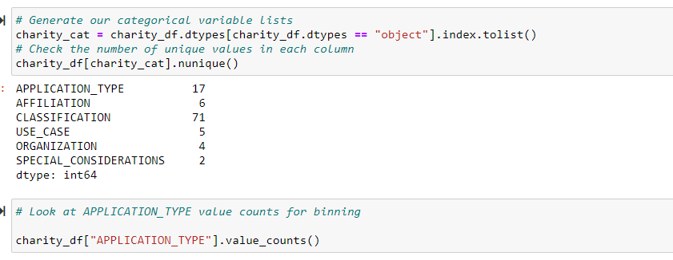

- Binning of the column values is performed on two columns.

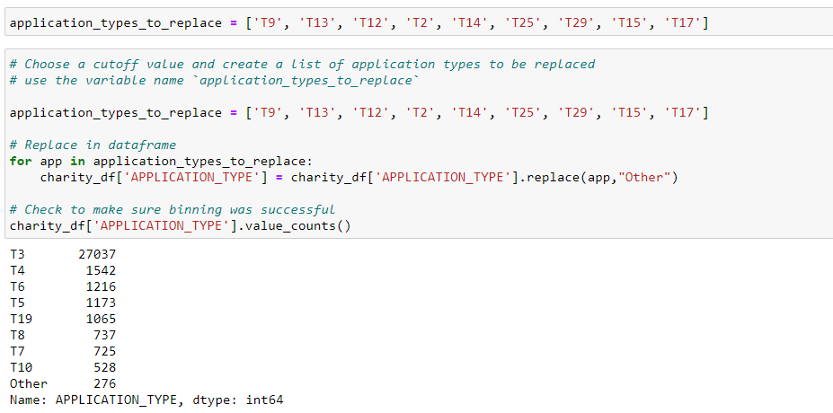

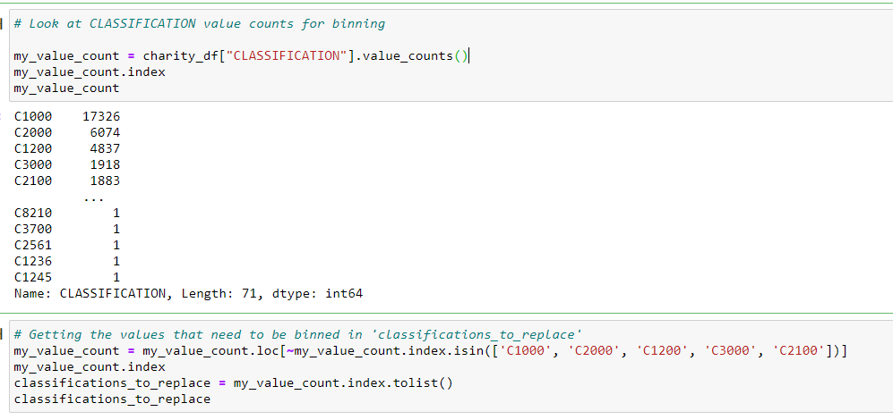

- Features are selected for further processing. 'IS_SUCCESSFUL' column is selected as target to predict.

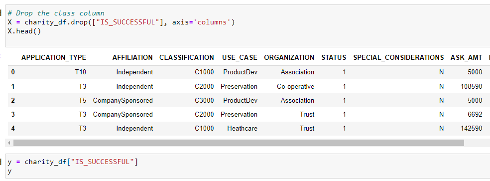

- Splitting and normalization of the data is performed.

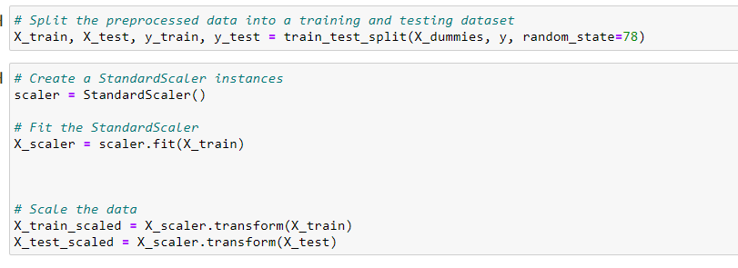

## Step 3: Model Optimization:

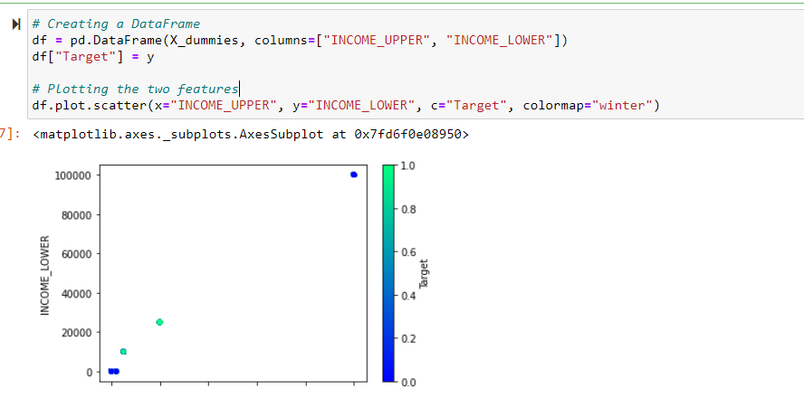

- Model optimization is performed with the target to achieve accuracy of 75% or higher. Three attempts are made by adding more neurons to the hidden layer, adding more layers, and using different activation functions for the hidden layers. Also, adding or reducing the number of epochs to the training regimen.

- First attempt:

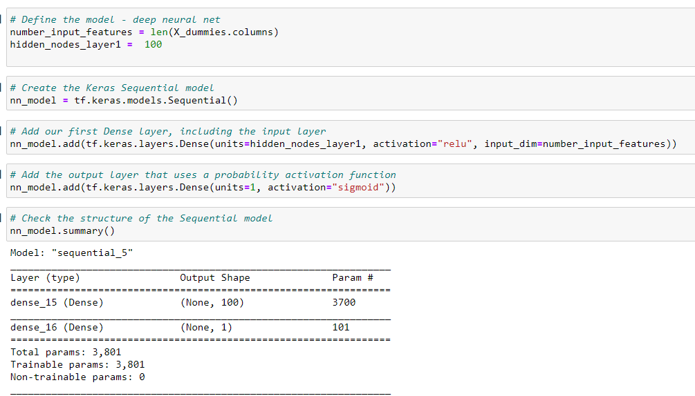

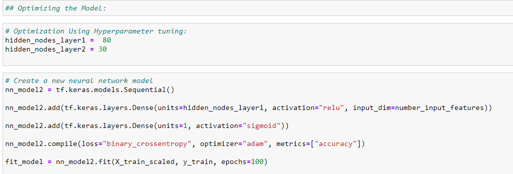

- Second Attempt:

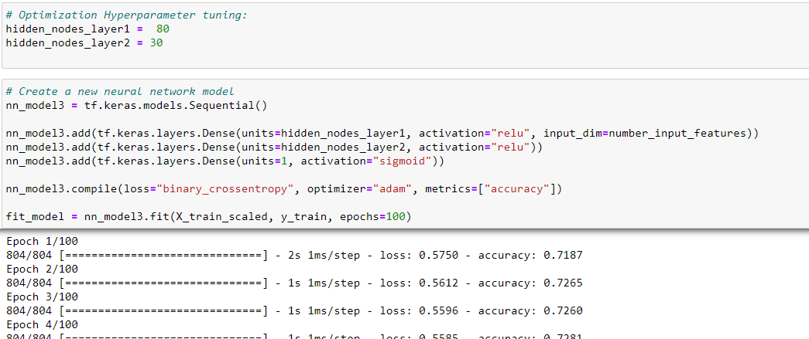

- Third Attempt:

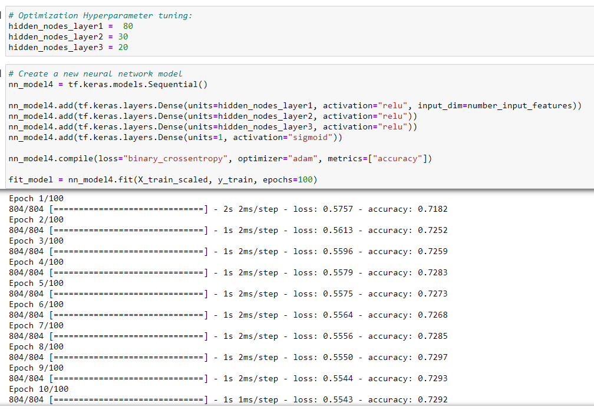

## Step 4: Report on the Neural Network Model:

## Purpose of the Analysis: 

- The purpose of the analysis is to achieve accuracy of 75% or higher, and we are able to achieve: accuracy of 0.7338 with a loss of 0.54

- Compiling, Training, and Evaluating of the Model is performed.

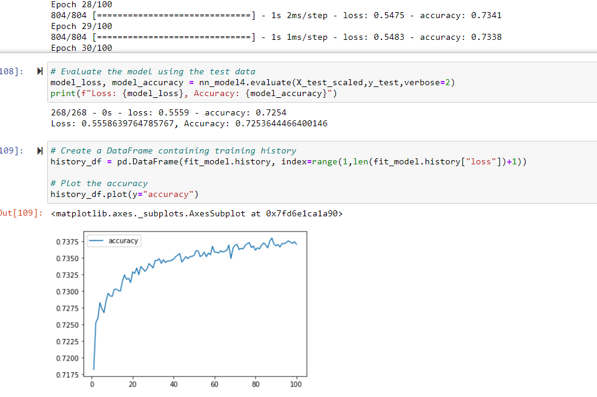

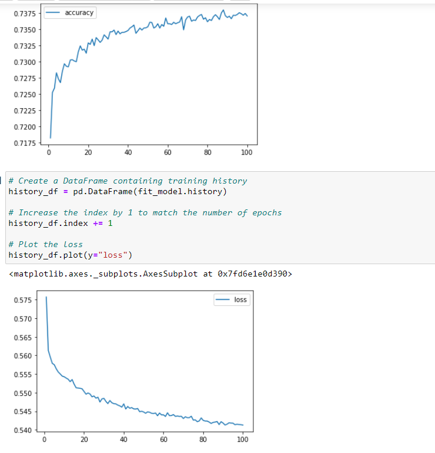

